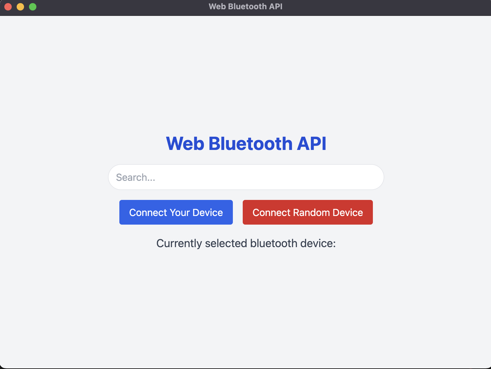
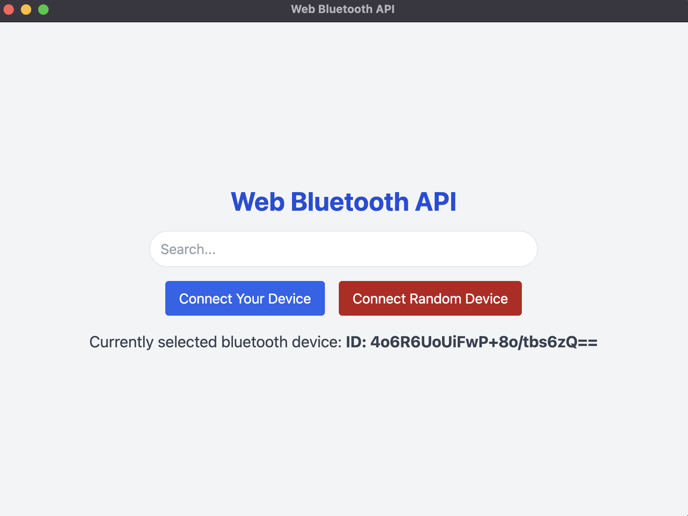
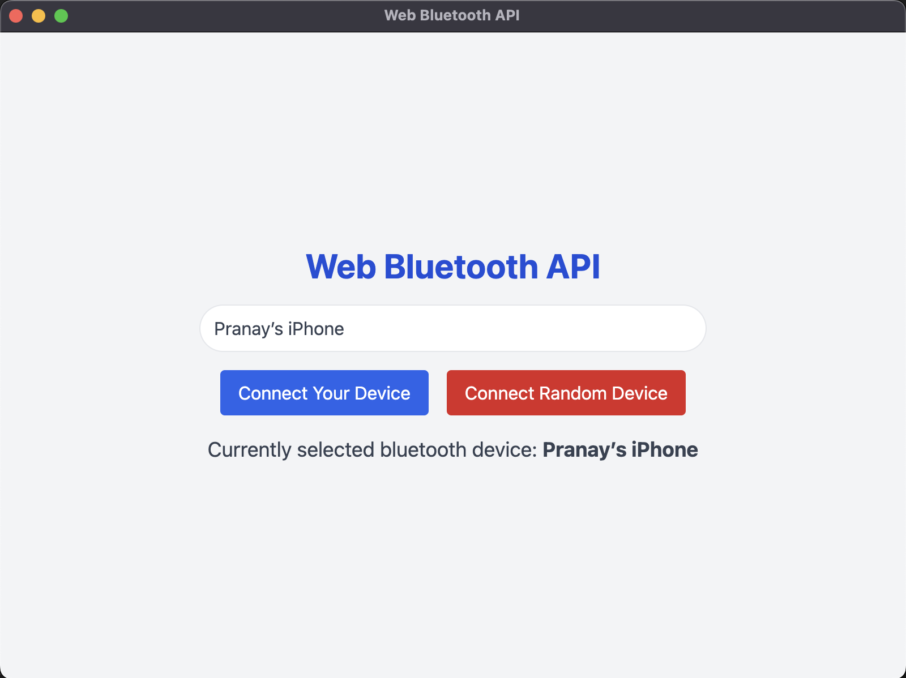

# Basic Electron App

This is a basic Electron application with Web Bluetooth integration. The application allows users to connect to Bluetooth devices directly from their desktop.

## Features

- Connect to a Bluetooth device of your choice
- Connect to a random Bluetooth device

## Screenshots



This screenshot shows the main window of the application.



This screenshot shows the Random Bluetooth device connection.


## Getting Started

To get started with this application, clone the repository and install the dependencies:

```bash
git clone https://github.com/pranayjoshi/electron-first-app.git
cd electron-first-app
npm install
npm start
```

# Off Topic

This App will also be available with React-Electron and vite suite.